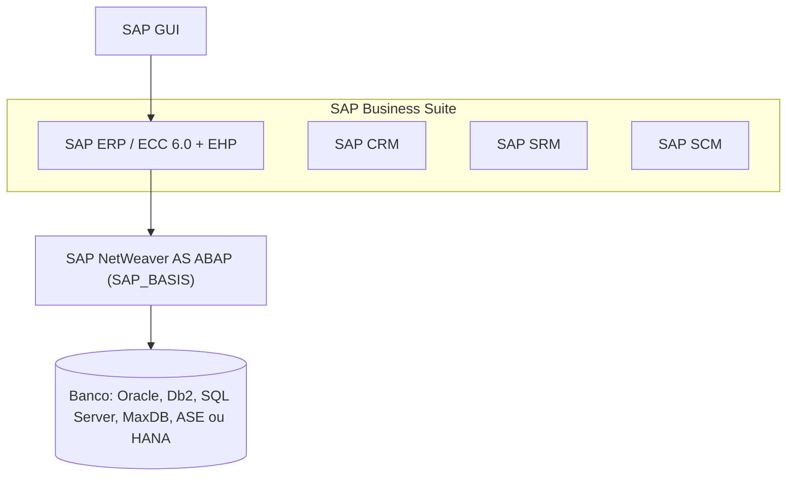
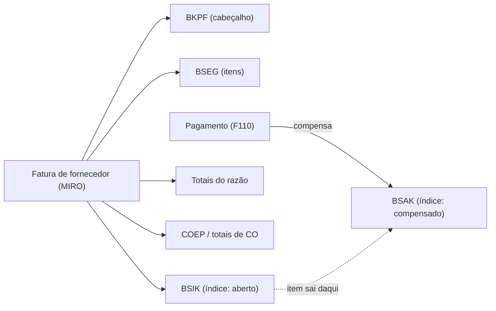

# SAP ECC - Study

> Nível: prática
> O ERP que a maior parte dos clientes SAP no Brasil ainda roda e que motiva a onda de migração para o S/4HANA. Relacionados: [SAP S/4HANA](https://github.com/igor-barral/SAP-S4HANA-erp-study), [Business Partner](https://github.com/igor-barral/SAP-Business-Partner-erp-study), [Estrutura organizacional](https://github.com/igor-barral/SAP-Enterprise-Structure-erp-study), [Migração para S/4HANA](https://github.com/igor-barral/SAP-S4HANA-Migration-erp-study), [RISE with SAP](https://github.com/igor-barral/RISE-with-SAP-erp-study).

## Objetivo

Entender o que é o SAP ERP Central Component (ECC), por que ele continua em produção em tantas empresas e, principalmente, como é o modelo de dados que um desenvolvedor encontra nele. Boa parte das vagas de ABAP no Brasil é de sustentação ou migração de ECC: quem entende as tabelas e os mecanismos de extensão do ECC entende também o que o S/4HANA simplificou e por que o código custom quebra numa conversão.

Ao concluir este estudo você deverá ser capaz de responder perguntas como:

- O que é o ECC 6.0 e o que são os *enhancement packages*?
- Quando termina a manutenção do ECC e que opções o cliente tem depois disso?
- Por que tanta empresa ainda roda ECC?
- O que um desenvolvedor encontra num ECC que não encontra num S/4HANA?
- Onde ficam, no ECC, cliente, fornecedor, documento de material e documento contábil?
- Para que servem as tabelas de índice como `BSIK` e `BSAK`, e por que elas deixaram de ser tabelas no S/4HANA?

---

## Ponte

| No que eu já conheço | No ECC |
|---|---|
| ERP próprio monolítico, um banco relacional, módulos (compras, vendas, fiscal) no mesmo código | ECC: um único sistema com módulos MM, SD, FI, CO, PP, WM etc. sobre o mesmo banco e o mesmo servidor de aplicação ABAP |
| Suporte a MySQL, Postgres e SQL Server no mesmo produto via camada de acesso a dados | ECC roda sobre vários bancos ("any DB") graças ao Open SQL, que abstrai o dialeto |
| Tabelas de resumo e contadores para o relatório não precisar somar milhões de linhas | Tabelas de totais e de índice (`GLT0`, `BSIK`, `BSAK`, `MARD`...) gravadas junto com o documento |
| Tabelas `clientes` e `fornecedores` separadas, às vezes com o mesmo CNPJ duplicado | `KNA1` e `LFA1`, com dados gerais duplicados quando a mesma empresa é cliente e fornecedora |
| Hooks, eventos e *plugins* do framework | *User exits*, *customer exits*, BAdIs e Enhancement Framework |
| Versão LTS de um framework com data de fim de suporte | ECC 6.0 com manutenção padrão até o fim de 2027 |
| Sistema legado que ninguém tem coragem de desligar | Exatamente o ECC em muitas empresas: estável, customizado ao longo de 15 ou 20 anos |

---

## Conteúdo

### 1. O que é o ECC

O SAP ERP Central Component é o núcleo do produto **SAP ERP**, parte da **SAP Business Suite**. A versão que o mercado encontra hoje é praticamente sempre a **ECC 6.0**, sobre a plataforma **SAP NetWeaver** (servidor de aplicação ABAP). Em vez de lançar um "ECC 7", a SAP passou a entregar funcionalidades por **enhancement packages** (EHP), instalados sobre o 6.0. O último é o **EHP 8**.

Pontos importantes para quem desenvolve:

- O EHP instalado e a versão do NetWeaver (*SAP_BASIS*) determinam **qual ABAP você tem**. Sintaxe moderna, como declarações inline (`DATA(...)`), expressões de construtor e o novo Open SQL com `@` nas variáveis, depende do release do *SAP_BASIS* (a partir do 7.40, com mais recursos no 7.50). Um ECC antigo pode não aceitar código que compila num S/4HANA. Confirme o release em *Sistema > Status* no SAP GUI.
- A interface principal é o **SAP GUI** (transações, *dynpros*). Fiori existe no ECC, mas de forma limitada.
- O modelo de extensão é o clássico: *user exits*, *customer exits* (SMOD/CMOD), BAdIs clássicas e do Enhancement Framework, modificações do padrão via chave de acesso.

### 2. Qualquer banco ("any DB") e o Suite on HANA

O ECC foi desenhado para rodar sobre bancos de terceiros: Oracle, IBM Db2, Microsoft SQL Server, SAP MaxDB e SAP ASE. A partir de 2013 passou a rodar também sobre o SAP HANA, cenário chamado **Suite on HANA**. O detalhe que confunde iniciantes: **ECC sobre HANA não é S/4HANA**. O modelo de dados continua o do ECC; só o banco mudou.

Consequências práticas:

- Todo acesso a dados passa pelo **Open SQL** (hoje ABAP SQL), que traduz para o dialeto do banco. SQL nativo existe (EXEC SQL, ADBC), mas é exceção.
- Como os bancos tradicionais não eram bons em agregar grandes volumes em tempo real, o ECC **grava agregados e índices redundantes** a cada documento. Esse é o ponto central do que o S/4HANA simplificou.

### 3. Fim da manutenção: por que há tantas vagas de migração

| Marco | Situação |
|---|---|
| Até o fim de 2027 | Manutenção padrão (*mainstream*) do SAP ERP 6.0 nos EHPs mais recentes |
| Até o fim de 2030 | Manutenção estendida opcional, contratada à parte |
| Depois | Manutenção específica do cliente (*customer-specific maintenance*), com suporte bem mais restrito |

A SAP também anunciou uma opção de transição para clientes que migrarem para a nuvem privada dentro do RISE, com prazo mais longo para o ECC operado pela SAP. Os detalhes comerciais e prazos exatos dessa opção devem ser confirmados na documentação oficial e no contrato do cliente.

A regra de mercado é simples: todo cliente ECC precisa decidir até 2027 (ou 2030) se converte para S/4HANA, reimplanta do zero ou paga para ficar. Cada uma dessas decisões gera projeto, e projeto gera vaga de ABAP. Os caminhos de migração estão em [SAP-S4HANA-Migration-erp-study](https://github.com/igor-barral/SAP-S4HANA-Migration-erp-study).

### 4. Por que tanta empresa ainda roda ECC

- **Customização acumulada.** Dez ou vinte anos de *Z programs*, *user exits* e modificações. Converter exige revisar esse código contra a *simplification list* do S/4HANA.
- **Funciona.** O ECC é estável; para a diretoria, migrar é custo e risco sem funcionalidade nova visível no curto prazo.
- **Custo e janela de negócio.** Uma conversão mexe em fechamento contábil, fiscal e logística ao mesmo tempo. No Brasil, a localização fiscal (NF-e, SPED, impostos) aumenta o esforço de teste.
- **Dependências.** Integrações (IDoc, RFC, arquivos), sistemas satélite e formulários (SAPscript, Smart Forms) construídos em cima do modelo antigo.
- **Prazo que já foi estendido antes.** O fim da manutenção era 2025 e passou para 2027, o que fez muita empresa esperar.

### 5. O modelo de dados que o S/4HANA simplificou

Esta é a parte que mais importa para o desenvolvedor: são as tabelas que aparecem em todo código ABAP legado.

#### Cliente e fornecedor separados

| Nível | Cliente | Fornecedor |
|---|---|---|
| Dados gerais (mandante) | `KNA1` | `LFA1` |
| Dados por empresa (*company code*) | `KNB1` | `LFB1` |
| Dados por área de vendas / organização de compras | `KNVV` | `LFM1` |
| Transações de manutenção | XD01/XD02/XD03 (central), VD01 (vendas), FD01 (contabilidade) | XK01/XK02/XK03 (central), MK01 (compras), FK01 (contabilidade) |

Uma mesma empresa que compra e vende para você existe duas vezes, com endereço e CNPJ duplicados. No S/4HANA isso é resolvido pelo [Business Partner](https://github.com/igor-barral/SAP-Business-Partner-erp-study).

#### Documento de material (estoque)

| Tabela | Conteúdo |
|---|---|
| `MKPF` | Cabeçalho do documento de material |
| `MSEG` | Itens do documento de material (movimentos) |
| `MARD` | Estoque por material, centro e depósito (agregado gravado) |
| `MARC` | Dados do material por centro |
| `MBEW` | Avaliação (valor do estoque) |

Cada entrada de mercadoria (MIGO) grava `MKPF`/`MSEG` **e** atualiza as quantidades em `MARD` (e outras tabelas de agregados). No S/4HANA, cabeçalho e item foram fundidos em `MATDOC` e os agregados passaram a ser calculados.

#### Contabilidade

| Tabela | Conteúdo |
|---|---|
| `BKPF` | Cabeçalho do documento contábil |
| `BSEG` | Itens do documento contábil (tabela *cluster* em bancos tradicionais) |
| `BSIK` / `BSAK` | Índice de itens de fornecedor em aberto / compensados |
| `BSID` / `BSAD` | Índice de itens de cliente em aberto / compensados |
| `BSIS` / `BSAS` | Índice de itens de conta do razão em aberto / compensados |
| `GLT0`, `FAGLFLEXT` | Totais do razão (clássico e *new G/L*) |
| `COEP`, `COSP`, `COSS` | Itens e totais de controladoria (CO) |

Por que existem as tabelas de índice? `BSEG`, em bancos tradicionais, é uma tabela *cluster*: não permite índice secundário nem consulta eficiente por campos que não sejam a chave. Para listar "itens em aberto do fornecedor X", o ECC grava a mesma informação de novo em `BSIK`, com chave por fornecedor. Quando o item é compensado, ele sai de `BSIK` e vai para `BSAK`. É redundância deliberada para performance.

No S/4HANA, contabilidade financeira e controladoria gravam numa única tabela, o **Universal Journal** (`ACDOCA`). `BSIK`, `BSAK`, `GLT0` e as demais passaram a ser views de compatibilidade calculadas sobre ela. Detalhes em [SAP-S4HANA-erp-study](https://github.com/igor-barral/SAP-S4HANA-erp-study) e [SAP-FI-erp-study](https://github.com/igor-barral/SAP-FI-erp-study).

#### Vendas

| Tabela | Conteúdo |
|---|---|
| `VBAK` / `VBAP` | Ordem de venda (cabeçalho / item) |
| `VBUK` / `VBUP` | Status do documento de vendas (cabeçalho / item) |
| `KONV` | Condições de preço calculadas no documento |
| `VBFA` | Fluxo de documentos |

`VBUK`/`VBUP` e `KONV` também mudaram no S/4HANA (status incorporados às tabelas do documento; condições em `PRCD_ELEMENTS`). Código legado que lê essas tabelas precisa de revisão na conversão.

### 6. O que o desenvolvedor encontra num ECC e não num S/4HANA

| No ECC | No S/4HANA |
|---|---|
| Tabelas de agregados e índices gravadas (`MARD` com quantidade, `BSIK`, `GLT0`) | Views de compatibilidade calculadas em tempo de leitura |
| `MKPF` + `MSEG` como tabelas reais | `MATDOC` real; `MKPF`/`MSEG` redirecionadas para views |
| Cliente e fornecedor mantidos por XD01/XK01 | Business Partner obrigatório (transação `BP`) |
| Número de material com 18 caracteres | Número de material pode ter até 40 caracteres |
| Banco de terceiros, SQL pensado para não agregar | Somente SAP HANA; CDS Views e agregação no banco |
| SAP GUI como interface principal | Fiori como interface principal (SAP GUI continua no on-premise) |
| Modelo de extensão clássico, modificações comuns | ABAP Cloud e Clean Core como direção oficial |
| WM clássico, SAPscript, BDC como prática comum | EWM, formulários Adobe e APIs; parte do legado ainda funciona, parte está na *simplification list* |
| Release do ABAP pode ser antigo (7.0x, 7.3x) | ABAP recente, com sintaxe moderna e ABAP Cloud |

### 7. Ferramentas de desenvolvimento do ECC

| Transação | Uso |
|---|---|
| SE38 / SE80 | Editor de programas / Object Navigator |
| SE11 | Dicionário de dados (tabelas, estruturas, elementos de dados) |
| SE37 | Módulos de função (inclusive BAPIs e RFCs) |
| SE24 | Class Builder |
| SE18 / SE19 | Definição / implementação de BAdIs |
| SMOD / CMOD | *Customer exits* |
| SE16 / SE16N | Visualização de tabelas |
| ST05 / SAT | Trace SQL / análise de runtime |
| SE09 / SE10 | Ordens de transporte |
| BAPI | BAPI Explorer |
| WE02 / WE19 | Monitor de IDocs / ferramenta de teste |
| SHDB | Gravador de *batch input* |

Essas transações continuam existindo no S/4HANA on-premise e na Private Edition; a diferença é que o desenvolvimento novo tende a ir para o ADT (Eclipse) e para ABAP Cloud.

---

## Respostas

**O que é o ECC 6.0 e o que são os enhancement packages?**
É o núcleo do SAP ERP, parte da SAP Business Suite, sobre o servidor de aplicação ABAP do NetWeaver. Os EHPs são pacotes de funcionalidade instalados sobre o 6.0 (até o EHP 8) em vez de uma nova versão principal; muitas funções vêm desativadas e são ligadas por *business functions*.

**Quando termina a manutenção do ECC?**
A manutenção padrão vai até o fim de 2027; a estendida, opcional e paga à parte, até o fim de 2030. Depois disso resta a manutenção específica do cliente, bem mais limitada. Existe ainda uma opção de transição ligada ao RISE cujos termos devem ser confirmados na documentação da SAP.

**Por que tanta empresa ainda roda ECC?**
Porque funciona, porque tem anos de customização que precisariam ser revistos, porque a conversão mexe em contabilidade, fiscal e logística ao mesmo tempo e porque o prazo de manutenção já foi estendido uma vez, o que incentivou esperar.

**O que um desenvolvedor encontra num ECC que não encontra num S/4HANA?**
Tabelas de agregados e de índice gravadas (`BSIK`, `BSAK`, `GLT0`, quantidades em `MARD`), `MKPF`/`MSEG` como tabelas reais, cliente e fornecedor separados em `KNA1`/`LFA1` sem Business Partner obrigatório, bancos de terceiros, releases de ABAP mais antigos e um modelo de extensão onde modificação do padrão era prática comum.

**Onde ficam cliente, fornecedor, documento de material e documento contábil?**
Cliente em `KNA1`/`KNB1`/`KNVV`; fornecedor em `LFA1`/`LFB1`/`LFM1`; documento de material em `MKPF`/`MSEG`; documento contábil em `BKPF`/`BSEG`, com índices em `BSIK`/`BSAK`, `BSID`/`BSAD` e `BSIS`/`BSAS`.

**Para que servem as tabelas de índice e por que deixaram de ser tabelas?**
`BSEG` não permite consulta eficiente por fornecedor ou cliente em bancos tradicionais, então o ECC duplica os itens em tabelas com chave adequada, separando aberto e compensado. No S/4HANA, com o HANA e o Universal Journal, a consulta direta é rápida o bastante e a redundância foi eliminada; os nomes antigos viraram views de compatibilidade para não quebrar leituras existentes.

---

## Referências

- SAP Help Portal: https://help.sap.com (buscar "SAP ERP 6.0", "enhancement package 8")
- SAP Support Portal, Product Availability Matrix: https://support.sap.com (buscar "Product Availability Matrix" para datas de manutenção)
- SAP Learning: https://learning.sap.com (trilhas introdutórias sobre S/4HANA, que comparam com o ECC)
- SAP Community: https://community.sap.com (buscar "ECC end of maintenance 2027", "BSEG cluster table")
